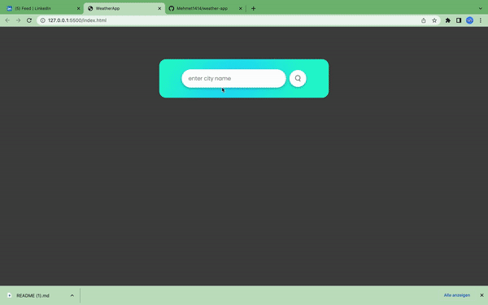

# Weather App

Bu bir gelistirme Projesidir


<p>Bu proje; JS tabanli bir Weathere App sayfasidir.OpenWeather sayfasindan API ile veri alindi...</p>

<h1>Kullanilan Teknolojiler</h1>
<p>JS</p>
<p>HTML-CSS</p>
<p>Git-GitHup</p>


## Demo

</img>


## Authors

- [@Mehmet1414](https://github.com/Mehmet1414)


## Appendix


- [OpenWeather](https://openweathermap.org/)
## API Reference

#### Get all items

```http
  GET /api/items
```

| Parameter | Type     | Description                |
| :-------- | :------- | :------------------------- |
| `api_key` | `string` | **Required**. a303435a00feb1cd99802f5cbb8ed2e6 |

#### Get item

```http
  GET /api/items/${id}
```

| Parameter | Type     | Description                       |
| :-------- | :------- | :-------------------------------- |
| `id`      | `string` | **Required**. https://api.openweathermap.org/data/2.5/weather?q=istanbul&appid=a303435a00feb1cd99802f5cbb8ed2e6 |


## 🚀 About Me
I'm a Front-End | React.js developer...


## Other Common Github Profile Sections
👩‍💻 I'm currently working on...

🧠 I'm currently learning...

👯‍♀️ I'm looking to collaborate on...

🤔 I'm looking for help with...

💬 Ask me about...

📫 How to reach me...

😄 Pronouns...

⚡️ Fun fact...


## 🔗 Links

[](https://www.linkedin.com/in/mehmet1414/)
[](https://twitter.com/mhmtydn_1414)


## Tech Stack

**Client:** HTML, CSS, JS

**Server:** Node


## Run Locally

Clone the project

```bash
  git clone https://github.com/Mehmet1414/weather-app
```

Go to the project directory

```bash
  cd weather-app
```

Install dependencies

```bash
  npm install
```

Start the server

```bash
  npm run start
```


## Running Tests

To run tests, run the following command

```bash
  npm run test
```

